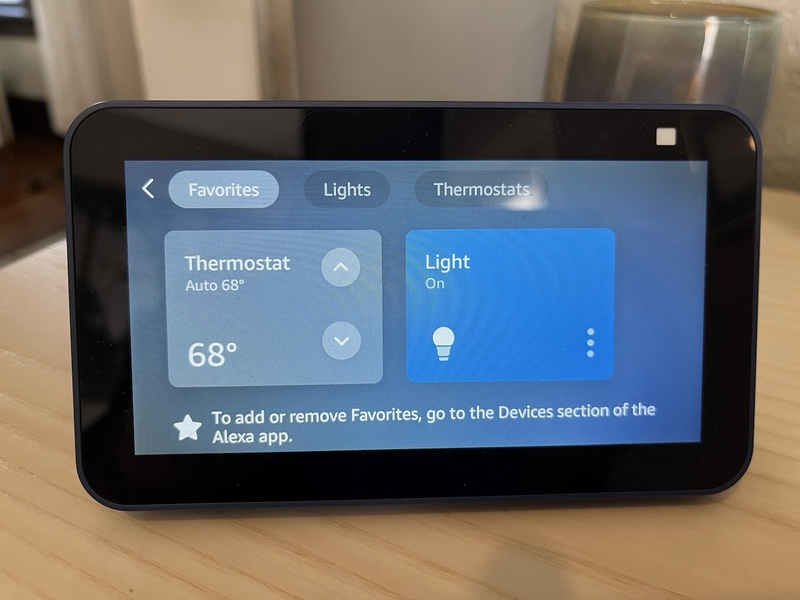

# Alexa Smart Properties Smart Home Sample Skill



This Alexa sample skill demonstrates how to build a skill for Alexa Smart Properties that utilizes [Delegated Account Linking](https://developer.amazon.com/en-US/docs/alexa/alexa-smart-properties/managing-skills.html#use-account-linking-and-partitions-in-skill-enablements). The skill supports both Authorization and Delegation flows but the emphasis is on learning how to extract the delegated scope/partition value from an Alexa request in order to properly segment device control to individual rooms while allowing the convenience of a single account link. This is in contrast to to the consumer/authorization flow in which one would have to manage and link separate 3P accounts for each room on property.

You may use this sample skill as a starting point to build your own Alexa Smart Properties Smart Home skill, though significant changes will be necessary to properly customize it for your back end service.

## Skill Overview

This skill can be linked to units in a building via Account Linking Delegation Flow or Account Linking Authorization Flow. In either case three "dummy" Smart Home devices will be created for the link - a light, a thermostat, and an interior blinds. The state of these "dummy" devices will be stored in DynamoDB and Account Linking credentials will be managed by Cognito.

The following are example utterances for controlling the devices.

- **_"Alexa, turn on the light"_** - Turns on the light
- **_"Alexa, turn off the light"_** - Turns off the light
- **_"Alexa, open the blinds"_** - Opens the blinds
- **_"Alexa, close the blinds"_** - Closes the blinds
- **_"Alexa, set the thermostat to sixty eight"_** - Changes the setpoint of the thermostat to 68 F
- **_"Alexa, make it warmer in here"_** - Increases the setpoint of the thermostat by 2 degrees F
- **_"Alexa, what's the temperature in here?"_** - Responds with the current temperature

## About

This is not meant to be step by step guide to walk you through the fundamentals of skill development and deployment. There are plenty of guides to help in this area available on the Alexa GitHub page. Instead the focus will be going into detail on features helpful or specific to Alexa Smart Properties.

This guide assumes you have your developer environment ready to go and that you are familiar with Alexa Skill development, Node.js/Javascript, CLI (Command Line Interface) Tools, [AWS](https://aws.amazon.com/), and the [ASK Developer Portal](https://developer.amazon.com/alexa-skills-kit).

### Pre-requisites

- Node.js (> v20)
- Register for an [Amazon Business Account](https://business.amazon.com)
- Register for an [AWS Account](https://aws.amazon.com/)
- Register for an [Amazon Developer Account](https://developer.amazon.com)

### Additional Documentation

- [Official Alexa Smart Home Developer Documentation](https://developer.amazon.com/en-US/docs/alexa/smarthome/understand-the-smart-home-skill-api.html) - The official documentation covering all Smart Home features in Alexa
- [Official Alexa Skills Kit Node.js SDK](https://www.npmjs.com/package/ask-sdk) - The official Node.js SDK Documentation
- [Official Alexa Skills Kit Documentation](https://developer.amazon.com/docs/ask-overviews/build-skills-with-the-alexa-skills-kit.html) - Official Alexa Skills Kit Documentation
- [Official Alexa Smart Properties Documentation](https://developer.amazon.com/en-US/docs/alexa/alexa-smart-properties/about-alexa-smart-properties.html) - Alexa Smart Properties enables property owners and managers to deploy and manage Alexa-enabled devices at scale.

## Code Layout

Code is organized is standard [ASK CLI](https://developer.amazon.com/en-US/docs/alexa/smapi/ask-cli-intro.html) v2 form. Here are some file descriptions to aid finding specific features...

```
./lambda/cognito.js         # Interact with Cognito to pull profile information
./lambda/constants.js       # Centralized skill configuration
./lambda/ddb.js             # DynamoDB Client for reading and storing device state
./lambda/index.js           # Lambda entry point
./lambda/response.js        # Helper for generating Alexa response directives
./lambda/smarthome.js       # Smarthome discovery, control, reporting
```

## Guide Contents

1. Skill Overview _&lArr; (You are here)_
2. [Initialization and Setup: Cognito and DynamoDB](./instructions/1-initialization.md)
3. [Skill Deployment](./instructions/2-deployment.md)
4. [Skill Enablement](./instructions/3-skill-enablement.md)
5. [Delegated Account Linking](./instructions/4-delegated-account-linking.md)
6. [Smart Home Features](./instructions/5-smart-home-features.md)
