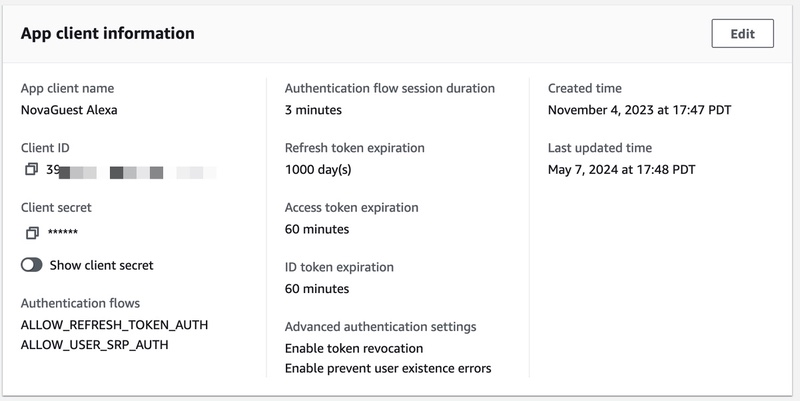
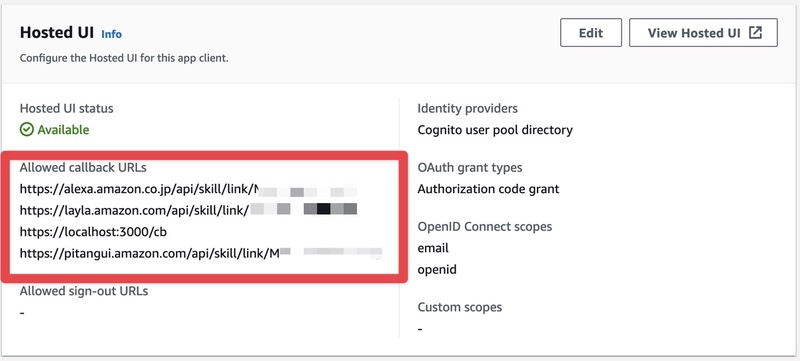
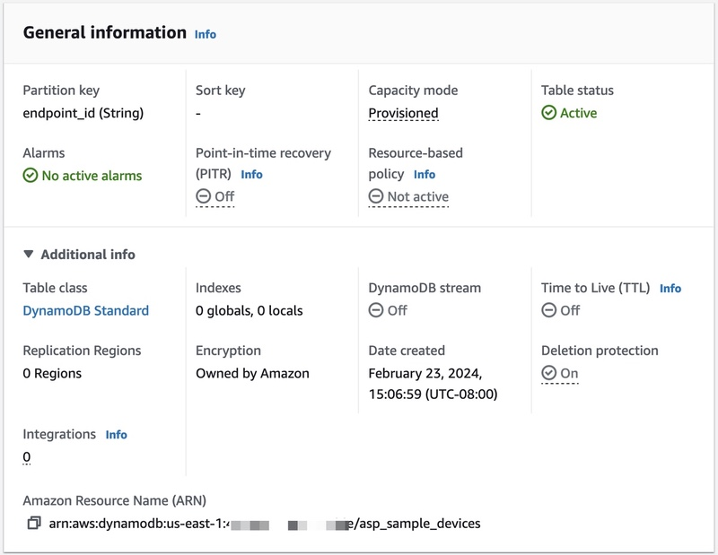

# Alexa Smart Properties Smart Home Sample Skill

## Initialization and Setup: Cognito and DynamoDB

This section will walk you through preparing services needed to by the Smart Home Sample skill to function. In particular we will use AWS Cognito as our identity service for account linking and DynamoDB to persist the state of our devices.

## Configure AWS Cognito as Your OAuth Server for Account linking

This skill was set up for account linking using [AWS Cognito](https://docs.aws.amazon.com/cognito/latest/developerguide/what-is-amazon-cognito.html). If you have another OAuth service provider everything should still work and you can skip this section.

If you are unfamiliar with OAuth2 the following are good resources.

- [An Introduction to OAuth 2](https://www.digitalocean.com/community/tutorials/an-introduction-to-oauth-2)
- [Understanding Amazon Cognito user pool OAuth 2.0 grants](https://aws.amazon.com/blogs/mobile/understanding-amazon-cognito-user-pool-oauth-2-0-grants/)

To set up your skill to use Cognito to manage account linking follow this guide.

- [Amazon Cognito for Alexa Skills User Management](https://aws.amazon.com/blogs/compute/amazon-cognito-for-alexa-skills-user-management/)

Once everything is set up you just create a user or two in your Cognito User Pool to use in the account linking flow in the Alexa App.

### Client Application Settings

### Client Redirect URLs

### A Couple Common Gotchas

- The Cognito URL for sign in once everything set up like this `https://{Sub-Domain}.auth.{Region}.amazoncognito.com/oauth2/authorize?response_type=code&redirect_uri=https://pitangui.amazon.com/api/skill/link/{Vendor ID}`. For simplicity you can use a custom domain for Cognito create a better branded url. That is what refrences to `https://cognito.novaguest.link` are in this skill.
- Make sure that the redirect url you send in an ASP API request to link is the same that you used to generate the auth token, else linking will fail.

## Prepare DynamoDB for Storing Device State

Pretty vanilla get/set for a table in Dynamo, using the [DynamoDB Javascript v3 SDK](https://docs.aws.amazon.com/AWSJavaScriptSDK/v3/latest/clients/client-dynamodb/index.html). For this sample the table is called **asp_sample_devices**, has a single partition key named **endpoint_id** of type String, and everything else is set to defaults. This results in a table looking like below.

| endpoint_id                          | blinds_mode   | light_state | thermostat_mode | thermostat_temperature |
| :----------------------------------- | :------------ | :---------- | :-------------- | :--------------------- |
| sample@domain-com-room101-blinds     | Position.Down |             |                 |                        |
| sample@domain-com-room101-light      |               | ON          |                 |                        |
| sample@domain-com-room101-thermostat |               |             | AUTO            | 68                     |

### DynamoDB Configuration

## Guide Contents

1. [Skill Overview](../README.md)
2. Initialization and Setup: Cognito and DynamoDB _&lArr; (You are here)_
3. [Skill Deployment](./2-deployment.md)
4. [Skill Enablement](./3-skill-enablement.md)
5. [Delegated Account Linking](./4-delegated-account-linking.md)
6. [Smart Home Features](./5-smart-home-features.md)
