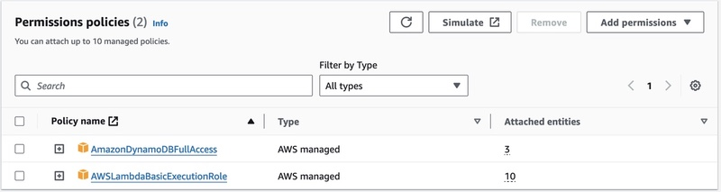
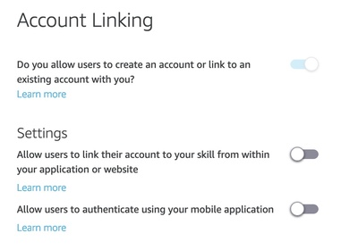
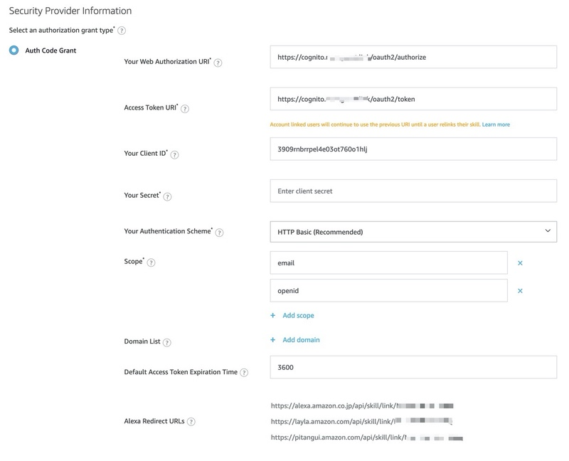

# Alexa Smart Properties Smart Home Sample Skill

## Skill Deployment

This skill can be deployed in whatever method you feel most comfortable with. It is packaged in ASK CLI 2.0 format for ease of use if you're comfortable with the CLI. It is also valid to zip the code, deploy manually to Lambda, and then manually configure with skill. Whatever works best. The rest of this section is coving common gotchas with deployment, generally around configuration and permissions.

## (Necessary) Code Changes

The most options most likely to need modification are found in the `constants.js` file. Pay special attention to PROFILE_API_ENDPOINT as that value is for the endpoint to access user profile information and almost certainly needs changing depending on your Cognito setup.

```javascript
module.exports = Object.freeze({
  // DynamoDB Config
  DDB_REGION: "us-east-1",
  DEVICE_TABLE_NAME: "asp_sample_devices",

  // Cognito Config
  PROFILE_API_ENDPOINT: "https://cognito.novaguest.link/oauth2/userInfo",

  // Smart Home Config
  // FAHRENHEIT or CELSIUS
  TEMPERATURE_SCALE: "FAHRENHEIT",
});
```

## AWS Permissions

### Lambda

Ensure your lambda function has access to DynamoDB. This is a bit permissive so tighten it up as you feel necessary.



## Skill Account Linking Setup

Turn on Account linking.



Bring over the following from your Cognito Setup...

- Web Authorization URI
- Access Token URI
- Client ID
- Client Secret

And take the given `Alexa Redirect URLs` and add them back to your Cognito Setup.



## Guide Contents

1. [Skill Overview](./README.md)
2. [Initialization and Setup: Cognito and DynamoDB](./instructions/1-initialization.md)
3. Skill Deployment _&lArr; (You are here)_
4. [Skill Enablement](./instructions/3-skill-enablement.md)
5. [Delegated Account Linking](./instructions/4-delegated-account-linking.md)
6. [Smart Home Features](./instructions/5-smart-home-features.md)
