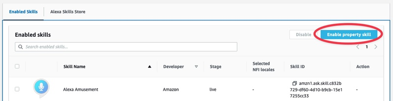
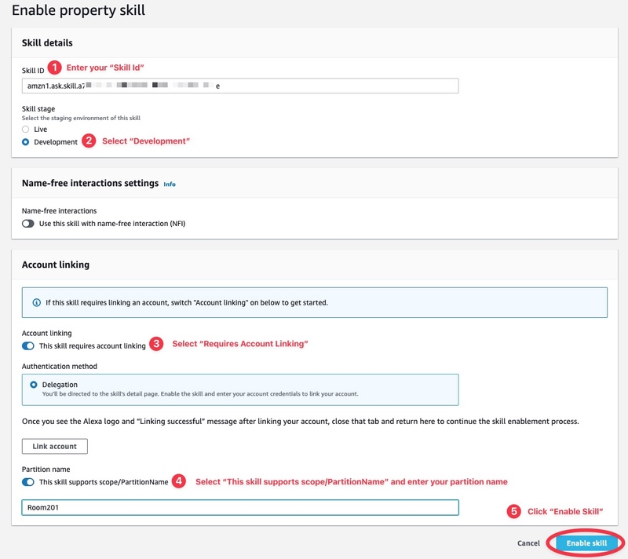
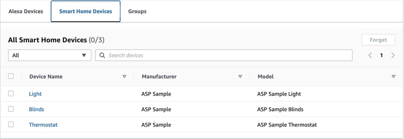

# Alexa Smart Properties Smart Home Sample Skill

## One Time Administrator Link

Now that the Alexa Smart Home skill is deployed we will need to enable it. The first step is to account link the skill to an administrator account on your ASP Organization. This need to happen only one as we will be using delegated account linking the rest of the way. All units will share this single account link. Note that The administrator account should also have access to your development account in order to enable the development skill. To complete this step...

1. If necessary, download the Alexa App to your phone or tablet.
2. Log into the Alexa App as your ASP Organization Administrator.
3. Click "More" from the bottom right of the app home screen.
4. Select "Skills & Games".
5. Scroll all the way to the bottom and click the "Your Skills" button.
6. Select "Dev".
7. Select ASP Smart Home Sample.
8. Click the "Enable to Use" button.
9. Complete account linking using credentials for a user that you generated in Cognito.

## Enable Smart Home Skill

Next, from within the ASP Console navigate to a unit that you would like to enable the skill on. Scroll to the bottom, select "Enabled Skills", and then click the "Enable property skill" button. If this had been a live skill we would have just searched for it in the "Alexa Skill Store" tab.

## Configure Delegated Account Link

At this point an account linking dialog will be presented, where the administrator will be able to set up the delegated account link. Note that we do not need to click the "Link Account" button on this page because we did a one time link in the first step and will only be using delegated auth from here on out.

1. Enter your "Skill Id".
2. Select "Development"
3. Toggle "Requires Account Linking" to on.
4. Toggle partition support to on and enter an appropriate partition name.
5. Click "Enable Skill".

Also, note that these steps can be performed via API using the [Skill Management API](https://developer.amazon.com/en-US/docs/alexa/alexa-smart-properties/discovery-session-api.html).

## Discover Devices

After the skill is enabled, a device discovery session will automatically begin. This skill will auto-generate three "dummy" devices; a light, a thermostat, and an indoor blinds. Once complete you can refresh your unit's page, select "Smart Home Devices", and see the following...

Additional discovery sessions can be initiated by either calling the [Discovery Session API](https://developer.amazon.com/en-US/docs/alexa/alexa-smart-properties/discovery-session-api.html), by asking an Alexa device in the Unit to "discover devices", or by clicking the "Discover Devices" button next to the skill on the Unit page.

## Guide Contents

1. [Skill Overview](./README.md)
2. [Initialization and Setup: Cognito and DynamoDB](./instructions/1-initialization.md)
3. [Skill Deployment](./instructions/2-deployment.md)
4. Skill Enablement _&lArr; (You are here)_
5. [Delegated Account Linking](./instructions/4-delegated-account-linking.md)
6. [Smart Home Features](./instructions/5-smart-home-features.md)
