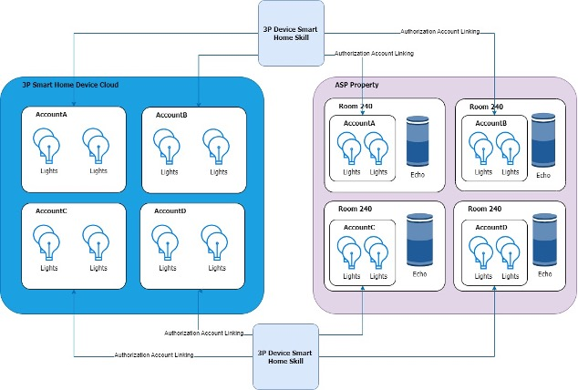
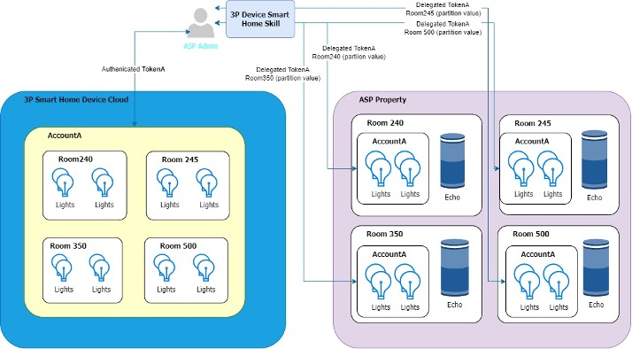

# Alexa Smart Properties Smart Home Sample Skill

## Understanding Account Linking

All consumer smart home skills have support for the authorization flow for account linking but some manufacturers also support the delegation flow used by Alexa Smart Properties. It is important to understand the differences between how these two types of account linking work and the effort required for each to deploy to a large property.

### Authorization Flow

In authorization flow the smart home devices controlled by the skill are determined by the manufacturer account that they are linked to via the smart home skill. In simple terms this means that separate manufacturer accounts need to be created for each room of the property. In a smaller property this may be ok. However, if the property has 500 units then 500 distinct manufacturer accounts will need to be created, linked, and maintained. This can add significant overhead to a deployment.



### Delegation Flow

In delegation flow the smart home devices controlled by the skill are determined by the manufacturer account that they are linked to via the smart home skill in addition to a supplied scope or partition name. This means, regardless of the size of property, that only one manufacturer account is required. Individual rooms, and their smart home devices, are identified by the scope/partition value (“Unit-102”, “Unit-204”, etc.) supplied when account linking the room.

Delegated account linking creates an association between the manufacturer account and the ASP admin’s Amazon Business account. After setup, the admin’s account credentials are delegated to the skill enablement API calls made for the skill for each room, saving the need to provide account details repeatedly in each call.



## Delegated Account Linking Code

In this skill we can see the code that handles both flows beginning at `smarthome.js:303`. Below is the code and the description of that code to help your understanding of the components of delegated account linking.

```javascript
//
// DELEGATED AUTH HANDLING BEGIN
//
// IDENTIFYING THE USER
// 1. The token identifies the user which is account linked.
// 2. The token can be used to look up the corresponding email address
//    in the OAuth server.
// 3. This email address is the primary key for segmenting device
//    control between units.
//
// IDENTIFYING THE PARTITION
// 1. The tokenType tells us if we're using Authorization Flow (BearerToken)
//    or Delegation Flow (BearerTokenWithPartition)
// 2. If it is delegation flow we can pull the partition value
//    from request.directive.payload.scope.partition.
// 3. This partition value is the secondary key for segmenting device
//    control between units.
//
// USING THE USER AND PARTITION TO SEGMENT CONTROL
// 1. In this sample we are using fake devices and will just create these
//    dummy devices with endpointIds in the form of
//    <EMAIL>-<PARTITION>-<DEVICE_TYPE>
// 2. In a real world implementation you will have real serial number and
//    and real user accounts to manage. Strategies will differ based on
//    your existing service implementation. The key details will
//    always be that (USER_ACCOUNT + PARTITION_VALUE) will be the
//    'owner' of the devices in a unit, not just the USER_ACCOUNT.
//

// Get the token
const token = request.directive.payload.scope.token;
const tokenType = request.directive.payload.scope.type;

// If we're using delegated account linking grab the partition value
const partition =
  tokenType === "BearerTokenWithPartition"
    ? "-" + request.directive.payload.scope.partition
    : "";

// Use the token to pull the account email from our
// Cognito OAuth provider
const email = await cognitoClient.getAccountEmail(token);

// Generate the endpointId prefix and remove invalid characters
let endpointIdPrefix = email + partition;
endpointIdPrefix = endpointIdPrefix.replace(/\./g, "-");
endpointIdPrefix = endpointIdPrefix.replace(/\+/g, "-");

//
// DELEGATED AUTH HANDLING END
//
```

## Guide Contents

1. [Skill Overview](./README.md)
2. [Initialization and Setup: Cognito and DynamoDB](./instructions/1-initialization.md)
3. [Skill Deployment](./instructions/2-deployment.md)
4. [Skill Enablement](./instructions/3-skill-enablement.md)
5. Delegated Account Linking _&lArr; (You are here)_
6. [Smart Home Features](./instructions/5-smart-home-features.md)
