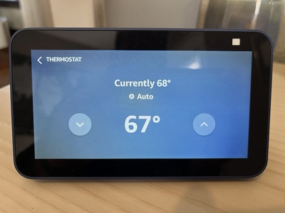
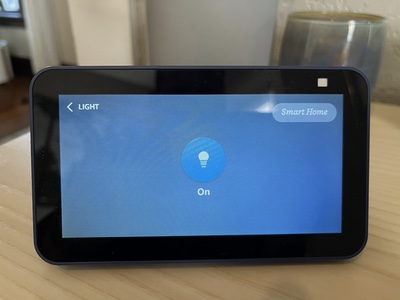

# Alexa Smart Properties Smart Home Sample Skill

## Smart Home and Features and Code Walkthrough

To provide testing capabilities in the skill a dummy light, thermostat, and interior blinds are generated at the time of skill enablement on a unit. For simplicity of management these devices have their state maintained in a DynamoDB table with EndpointIds generated from the linked account email, partition value, and device type. This takes the form of `<EMAIL>-<PARTITION>-<DEVICE_TYPE>`. For further details please see previous sections in this guide.

### Smart Home Disco Ball

#### Device Discovery

`lambda/smarthome.js # Lines 293-484`

Here you can see the [discovery response](https://developer.amazon.com/en-US/docs/alexa/device-apis/alexa-discovery.html) being built. Each of the three dummy devices gets a [endpoint health](https://developer.amazon.com/en-US/docs/alexa/device-apis/alexa-endpointhealth.html) interface and a generic Alexa Interface. The the endpoint health will provide connectivity state confidence (no endpoint unreachable errors) and the generic Alexa Interface is a baseline requirement for devices.

- For the [light](https://developer.amazon.com/en-US/docs/alexa/smarthome/get-started-with-device-templates.html#plug), `lambda/smarthome.js # Lines 377-408`, we are only exposing a [power controller](https://developer.amazon.com/en-US/docs/alexa/alexa-voice-service/alexa-powercontroller.html). This will allow us to control the light with on/off utterances.
- The thermostat, `lambda/smarthome.js # Lines 441-481`, is a very simple implementation as far as thermostats go. It has a single setpoint, a temperature sensor, and a mode. All control is assumed to be fahrenheit units. See the [Thermostat Controller](https://developer.amazon.com/en-US/docs/alexa/device-apis/alexa-thermostatcontroller.html) for details on all of the possible capabilities that can be controlled.
- Finally [the blinds](https://developer.amazon.com/en-US/docs/alexa/smarthome/get-started-with-device-templates.html#blinds) are implemented in `lambda/smarthome.js # Lines 410-439`. Again we went with the more simple approach, using a [mode controller](https://developer.amazon.com/en-US/docs/alexa/device-apis/alexa-modecontroller.html) only allowing them to be open or closed. [Range controller](https://developer.amazon.com/en-US/docs/alexa/device-apis/alexa-rangecontroller.html) is available if you need to be able to control in increments. We also use [semantics](https://developer.amazon.com/en-US/docs/alexa/device-apis/alexa-modecontroller.html#discover-blinds) which allows us to use "open" and "close" utterances in addition to the standard "raise" and "lower".

#### Device Control

`lambda/smarthome.js # Lines 150-273`

- For the light, `lambda/smarthome.js # Lines 246-273`, control is simple. We are listening for `TurnOn` and `TurnOff` [directives](https://developer.amazon.com/en-US/docs/alexa/device-apis/alexa-powercontroller.html#directives) - we take what incoming power state directive says and then persist it to the db and respond with success.
- The thermostat, `lambda/smarthome.js # Lines 179-244`, is the most complex device to control. We're listening for [several directives](https://developer.amazon.com/en-US/docs/alexa/device-apis/alexa-thermostatcontroller.html#directives); `SetTargetTemperature`, `AdjustTargetTemperature`, and `SetThermostatMode`. As with the others, just persist the state and respond with success.
- For the blinds, `lambda/smarthome.js # Lines 150-177`, we are listening for the [SetMode](https://developer.amazon.com/en-US/docs/alexa/device-apis/alexa-modecontroller.html#setmode-directive) directive on the mode controller. The mode value will be either `Position.Up` or `Position.Down` based on how we built the device in the discovery. We will simply persist the state of the device and respond with success.

#### State Reporting

`lambda/smarthome.js # Lines 78-148`

For this sample we are only doing retrievable [state reporting](https://developer.amazon.com/en-US/docs/alexa/device-apis/alexa-statereport.html#directives). A proper Smart Home device should always [update state proactively](https://developer.amazon.com/en-US/docs/alexa/smarthome/state-reporting-for-a-smart-home-skill.html). For additional details on this topic please see the published [best practices for change and state reporting](https://developer.amazon.com/en-US/blogs/alexa/alexa-skills-kit/2021/06/best-practices-to-send-state-and-change-reports).

#### Persisting Device State

`lambda/ddb.js`

Pretty vanilla get/set for a table in Dynamo, using the [DynamoDB Javascript v3 SDK](https://docs.aws.amazon.com/AWSJavaScriptSDK/v3/latest/clients/client-dynamodb/index.html). The table is called **asp_sample_devices** by default, has a single partition key named **endpoint_id** of type String, and everything else is set to defaults. This results in a table looking like below.

| endpoint_id                          | blinds_mode   | light_state | thermostat_mode | thermostat_temperature |
| :----------------------------------- | :------------ | :---------- | :-------------- | :--------------------- |
| sample@domain-com-room101-blinds     | Position.Down |             |                 |                        |
| sample@domain-com-room101-light      |               | ON          |                 |                        |
| sample@domain-com-room101-thermostat |               |             | AUTO            | 68                     |

## Guide Contents

1. [Skill Overview](../README.md)
2. [Initialization and Setup: Cognito and DynamoDB](./1-initialization.md)
3. [Skill Deployment](./2-deployment.md)
4. [Skill Enablement](./3-skill-enablement.md)
5. [Delegated Account Linking](./4-delegated-account-linking.md)
6. Smart Home Features _&lArr; (You are here)_
